# Marketplace Monitor: illustrated user guide

A practical guide to the Monitor and Settings console: first-time setup, saved
searches, AI evaluation, notifications, activity, and safe configuration editing.
This describes the console introduced in commit `4fd86b8`.

**Pictures use sample data.** Searches, credentials, and activity shown here are
demonstrations, not live Facebook results or proof of successful delivery. The
narrow-window example shows how the list stacks above the selected page.
Normal startup uses port **8467**; the screenshot preview used another port.

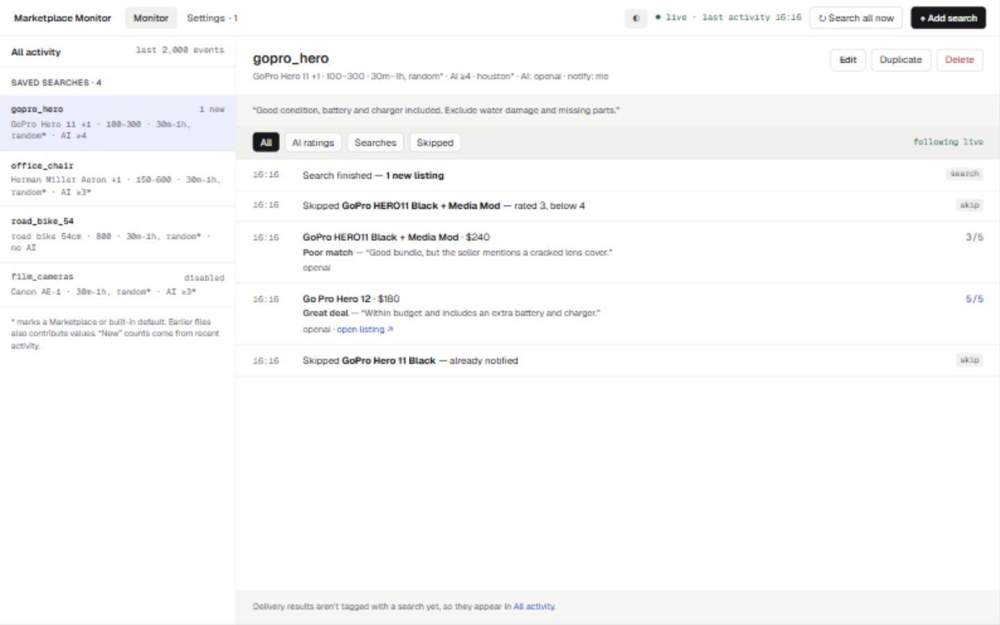

*Figure 1. Select a saved search on the left to see its description and activity
on the right. Monitor and Settings are the two main workspaces.*

## Contents

1. [Start the dashboard](#1-start-the-dashboard)
2. [Complete initial setup](#2-complete-initial-setup)
3. [Find your way around](#3-find-your-way-around)
4. [Create a saved search](#4-create-a-saved-search)
5. [Set prices and locations](#5-set-prices-and-locations)
6. [Understand defaults and overrides](#6-understand-defaults-and-overrides)
7. [Tune AI and advanced filters](#7-tune-ai-and-advanced-filters)
8. [Schedule and run searches](#8-schedule-and-run-searches)
9. [Duplicate, rename, disable, and delete](#9-duplicate-rename-disable-and-delete)
10. [Read activity and export CSV](#10-read-activity-and-export-csv)
11. [Manage marketplace accounts](#11-manage-marketplace-accounts)
12. [Configure AI providers](#12-configure-ai-providers)
13. [Set up notification users](#13-set-up-notification-users)
14. [Use shared notification settings](#14-use-shared-notification-settings)
15. [Configure proxies, regions, and languages](#15-configure-proxies-regions-and-languages)
16. [Edit TOML and keep secrets safe](#16-edit-toml-and-keep-secrets-safe)
17. [Save and recover from conflicts](#17-save-and-recover-from-conflicts)
18. [Use themes and keyboard controls](#18-use-themes-and-keyboard-controls)
19. [Access the dashboard remotely](#19-access-the-dashboard-remotely)
20. [Troubleshoot and establish a routine](#20-troubleshoot-and-establish-a-routine)

## 1. Start the dashboard

The monitor must already be installed. See [installation](installation.rst) and
[quick start](quickstart.rst) for installation steps.

1. Open a terminal in the environment where the monitor is installed.
2. Run the command below and leave the process running.
3. Open the URL printed in its startup banner.

```powershell
ai-marketplace-monitor
```

The default address is `http://127.0.0.1:8467`. The web interface runs inside the
monitor process. Closing its terminal or stopping the process stops the dashboard;
opening the browser does not start the monitor.

From this repository's existing Windows virtual environment, you can also use:

```powershell
.\.venv\Scripts\ai-marketplace-monitor.exe
```

If the default port is occupied, choose another one:

```powershell
ai-marketplace-monitor --webui-port 9090
```

Then open `http://127.0.0.1:9090`. To run without the dashboard, add `--no-webui`.
Local loopback access normally opens without a dashboard sign-in. Facebook may
still need a separate login, two-factor code, or CAPTCHA in the monitor's browser.

## 2. Complete initial setup

A new installation creates a starter configuration. The checklist can appear when
the only search is the untouched `example` search. Use this order even if your
configuration already contains other searches:

1. Open **Settings > Marketplace**. Set the Facebook login and a search city.
2. Open **Monitor**. Edit the example search or choose **+ Add search**.
3. Open **Settings > Notifications**. Give user `me` a usable channel.
4. Optionally open **Settings > AI providers** and add a provider.
5. Save each form, return to Monitor, and inspect actual activity.

Keep at least one marketplace, saved search, and user. A user without a channel
can exist but cannot deliver an alert. The Settings badge counts setup issues,
including users with no usable channel or missing login information. Dismissing
the checklist hides it for the current browser session; it does not configure
anything.

Check the complete flow when connecting real services. A saved search proves that
configuration exists. Activity proves that events reached the dashboard. Verify
AI-provider behavior and actual notification receipt separately.

## 3. Find your way around

| Area | What you do there |
| --- | --- |
| Monitor | Select searches and read their descriptions, ratings, skips, and summaries. |
| All activity | Read events across searches, login/browser events, errors, and delivery results. |
| Marketplace | Manage Facebook accounts and defaults shared by searches. |
| AI providers | Set provider, model, key, endpoint, timeout, and retries. |
| Notifications | Manage individual users and shared delivery settings. |
| Proxy, regions, languages | Set network options and manage reusable locations and language definitions. |
| config.toml | Edit the last loaded file directly and see contributing source files. |

On desktop, the list and selected page scroll independently. In narrow windows,
the list sits above the page; scroll down to reach its content. The URL identifies
the view and activity filters, allowing a normal reload to return to that view.
Save drafts before closing or reloading.

The **live** indicator describes the activity connection. It does not certify that
Facebook is signed in, an AI key works, or a message arrived. Read global notices,
activity, and the terminal for those details.

## 4. Create a saved search

This worked example looks for a used GoPro, with a maximum price of 300, and alerts
user `me` about complete working kits.

1. Choose **+ Add search**.
2. Name it `gopro_hero`. New names use letters, numbers, and underscores.
3. Keep **Status** enabled.
4. Add `GoPro Hero 11` and press Enter. Add `GoPro Hero 12` as another chip if wanted.
5. Enter a concrete description: `Good condition, battery and charger included.
   Exclude water damage and missing parts.`
6. Set price, location, rating, schedule, and recipients in the following sections.
7. Select **Save search** and read the result message.

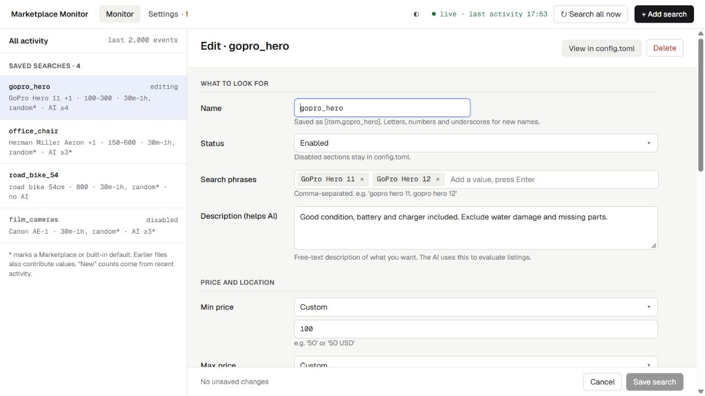

*Figure 2. Phrases drive queries; the description tells the AI what makes a good match.*

Use a phrase a seller is likely to write. Put detailed requirements in Description
or advanced filters rather than making every query a long wish list. Press Enter
to create one chip per phrase, and use its x button to remove it. Moving away from
an unfinished chip input can also add the text; Enter makes the intended list
explicit.

Saving validates the configuration. The monitor reloads it at its next safe point
and may restart searches. A successful save is not a promise of immediate results
or delivered alerts.

## 5. Set prices and locations

For the example, choose **Custom** beside Min price and Max price, then enter `100`
and `300`. Keep a bound at **Use default** to inherit it. A default of `none` means
no configured bound on that side. Supported money strings such as `300 USD` are
also accepted.

Under **Where**, choose one location strategy:

| Choice | Effect |
| --- | --- |
| Use default | Inherit the marketplace or contributing configuration location. |
| Cities | Set city codes or numeric IDs, with optional per-city radius and currency. |
| Region | Select built-in or custom regions that expand into city searches. |

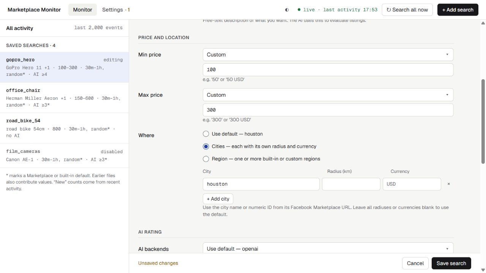

*Figure 3. Cities supports one row per location and overrides the shared location.*

Use the city code or numeric ID from its Facebook Marketplace URL. Choose **+ Add
city** for another row. Radius is in kilometres. Fill every row's radius when you
set radiuses explicitly, or leave all blank to use defaults. Follow the same rule
for per-city currencies.

Regions replace cities. A large region can require many searches, so review its
definition before selecting it. For a reusable small city set, create a custom
region as described in section 15.

## 6. Understand defaults and overrides

**Use default** removes the local override and uses the displayed inherited value.
**Custom** enables the field and records an explicit value. For ordinary search
fields, the order is item, marketplace, then built-in defaults. Summary asterisks
identify values the search does not define itself.

For example, a marketplace city of `houston` applies to searches using its default.
A search explicitly set to `austin` keeps that override when the marketplace city
changes. Common built-in values include rating 3 and a random interval between
30 and 60 minutes, unless your configuration supplies other defaults.

Only the last loaded config file is editable in the dashboard. Earlier files still
contribute values. Lists combine across files: removing a local chip does not remove
an inherited entry. Edit the earlier source to remove that entry.

Empty lists have different meanings:

| Field | An explicit empty list means |
| --- | --- |
| `ai = []` | Use no AI backend for this search. |
| `notify_with = []` | Apply no shared notification sections to this user. |
| `notify = []` | Falls back to users; it does not mean notify nobody. The guided form rejects this ambiguous choice. |

Disable a search to stop it. Select intended users explicitly to change who receives
alerts. Do not assume every empty field disables the associated behavior.

## 7. Tune AI and advanced filters

### AI and notification minimums

Choose Custom for AI backends to select specific providers, or inherit the default
selection. Set AI rating threshold to the minimum match score you want. The control
labels 4 as a good match and 5 as a great deal; Description supplies your criteria.

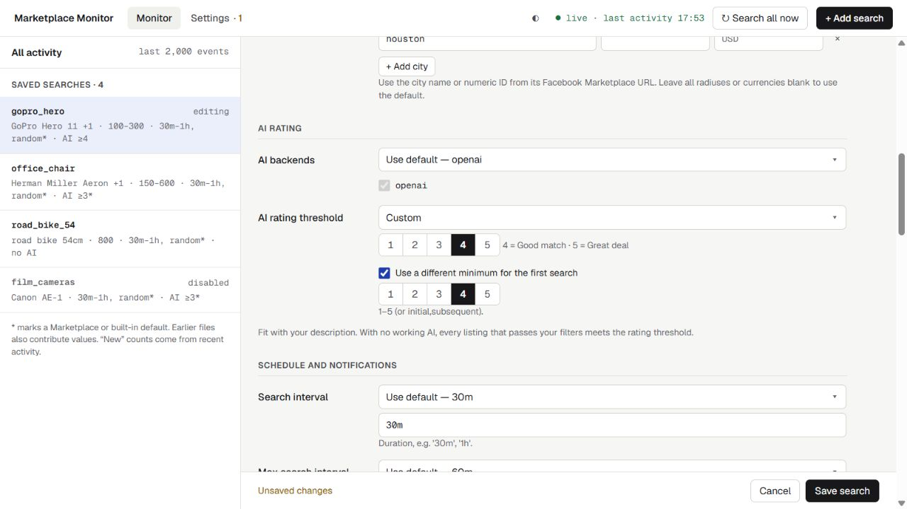

*Figure 4. A different first-search minimum can treat the initial backlog more strictly.*

For example, choose 5 for the first search and 4 for later searches. In TOML this is
`rating = [5, 4]`: first value initially, last value thereafter. Reloading a search
after configuration changes can begin another initial scan; review its activity.

Without a working AI evaluation, listings passing ordinary filters meet the rating
threshold. Raising the threshold is not a substitute for a working provider. An
AI-rating event also does not prove that a notification was delivered.

### Advanced search options

Expand **Advanced options** for marketplace selection, category, condition,
availability, date listed, delivery method, sellers, Boolean keywords, prompts,
sort order, and city display names. The disclosure counts customized fields in
the editable section.

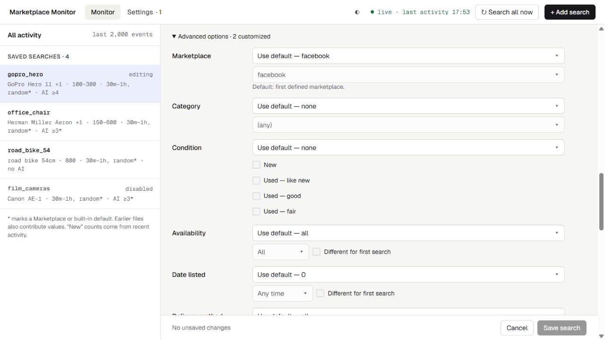

*Figure 5. Advanced fields retain default-versus-custom choices.*

Availability, Date listed, and Delivery method can differ for first and later
searches. For example, search any listing age initially and the last 24 hours later.
Condition instead uses the selected condition set.

Examples for Keywords and Anti-keywords:

```text
camera AND (Canon OR Nikon)
```

```text
"for parts" OR broken
```

Use separate lines for multiple expressions. Inspect skips and errors if an
expression behaves unexpectedly. Start with a clear Description before replacing
or extending AI prompts.

## 8. Schedule and run searches

Search interval is the lower interval; Max search interval supplies the upper
bound for random spacing. With `30m` and `60m`, runs are scheduled randomly between
those bounds. Choose Custom before editing inherited values. Duration examples
include `30m`, `1h`, and `1d`.

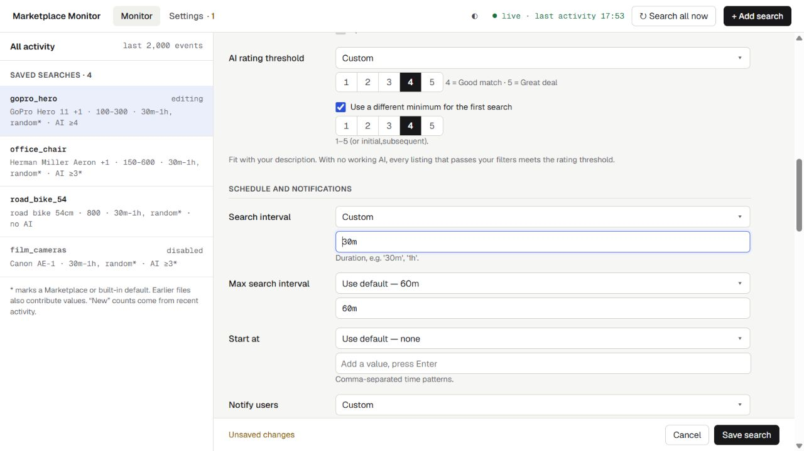

*Figure 6. Keep shared schedule defaults or customize intervals and recipients.*

Use **Start at** for fixed times instead of interval scheduling. Add each time as a
separate chip, such as `09:00` and `18:00` for daily runs. Supported repeating patterns
include `*:30` and `*:*:15`; daily times are easier to manage unless you specifically
need these frequent patterns. The scheduler uses the host computer or container's
clock.

The monitor performs an initial search when starting or reloading, then follows
the schedule. Fixed times do not suppress that initial scan. Multiple fixed times
schedule multiple later runs for the same search.

**Search all now** requests all enabled searches after the current scan reaches a
safe point. It does not interrupt that scan. While searches run, the button shows
the active search and how many are queued, and stays disabled until the requested
searches finish. The sidebar marks the running search **searching…** and the
others **queued**. This console has no per-search Run now or next-run countdown;
check activity or terminal output for the scheduler's next-job details.

Each saved search shows **Last searched at: HH:MM** in the sidebar and its activity
header, using your browser's local time. This is the latest completed search seen
in available activity, including searches with zero new listings. Hover over the
label for the full date and time. A dash means no completion is available. The
time stays visible as events leave the feed while the page remains open; reloading
uses the remaining activity buffer, and restarting the monitor clears it.

## 9. Duplicate, rename, disable, and delete

- **Duplicate:** select a search, choose Duplicate, review the `_copy` name and
  inherited settings, adjust the draft, and save. Cancel returns to the original.
- **Rename:** edit Name and save. Guided renames update supported references in
  the editable file and preserve hidden secrets. A section also defined in an
  earlier file must be renamed in that source file.
- **Disable:** set Status to Disabled and save. The section remains in the file
  for later reuse. This is different from pausing the displayed activity.
- **Delete:** read the confirmation and remove the section only when intended.
  Recorded activity stays, but there is no trash or saved-deletion undo history.
  Keep a private configuration backup when you may need to restore a section.

The interface prevents deleting the last marketplace, search, or user. Inherited
sections cannot be removed from their source through the editable file: disable
them here or edit the contributing file. Use raw TOML for names or structures
outside the guided rename's supported format.

## 10. Read activity and export CSV

| Event | Meaning |
| --- | --- |
| AI rating | A match score, assessment, and provider; a listing link when available. |
| Search finished | New listings reported by the search, not messages delivered. |
| Skipped | A reason such as already notified or below threshold. |
| Login/browser | Credentials found, waiting for credentials, or a browser launched. |
| Error | Failure details and, when available, a link to relevant settings. |

Choose **All activity** for events across searches and delivery results that lack
a search identifier. A selected search shows its tagged events; use All activity
when a delivery event is absent from that view.

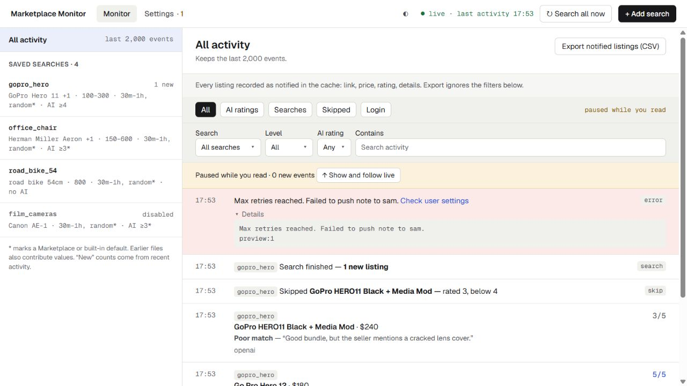

*Figure 7. Expanding Details pauses display updates while the monitor keeps working.*

Use type buttons and the Search, Level, AI rating, and Contains filters in All
activity. Filters combine, so an Error filter plus an AI-rating filter may show
no events. Contains searches message text. The filter URL survives normal reloads.

Scrolling away from the top or expanding Details pauses the displayed feed.
Incoming events continue; the paused bar counts them. Choose **Show and follow live**
to resume and return to the newest events. Filters and display pause do not stop
searches.

Recent activity is buffered in memory, normally 2,000 events. New events evict old
ones, and restarting the process begins a new stream. Reconnection reloads available
buffered records. This is not a persistent results-history browser.

### Export notified listings

1. Open **All activity**.
2. Choose **Export notified listings (CSV)** and wait for the download.
3. Find the file in your browser's downloads and open it in a spreadsheet app.
4. Filter `item` for a saved search or `notified_user` for a recipient.
5. Compare the price, rating, and comment; use `url` to open a listing.

The download reads the full cached notification history, independent of filters
and the activity buffer. Setting an activity filter before export does not narrow
the file. Export reads existing records; it does not start a new search.

| CSV fields | How to read them |
| --- | --- |
| `found_at`, `item`, `marketplace` | The cached notification timestamp, saved search name when available, and marketplace. |
| `title`, `price`, `url` | Available listing details and a link back to the listing. |
| `rating`, `ai_comment` | The cached AI score and assessment, when available. |
| `location`, `seller`, `condition` | Additional cached listing details. |
| `notified_user` | The recipient associated with that cached notification record. |

Rows are ordered newest first. The same listing can appear for different users.
Blank cells mean the related details or rating are unavailable in the cache; a
blank rating does not mean zero. These are cached observations, so confirm current
price and availability on the marketplace before acting on an old export.

If no notified listings are cached, the UI reports nothing to export. A cached row
is not independent proof that a recipient received a message. Verify delivery in
activity and with the recipient.

## 11. Manage marketplace accounts

Open **Settings > Marketplace**, choose an account, and edit it. For an additional
account use **+ Add marketplace** with a distinct name. A search's advanced Marketplace
field selects its account; otherwise the first marketplace is the default.

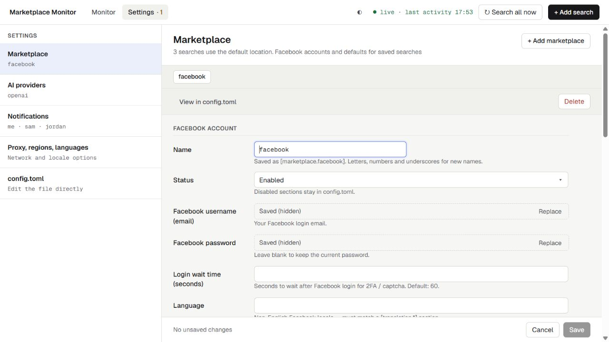

*Figure 8. Login fields stay hidden; shared search defaults appear below them.*

Choose Replace to enter a login value or environment reference. Leave its input
empty or choose Keep current to retain the existing value. Login wait time gives
you time to finish Facebook login prompts.

The next section holds shared locations, intervals, AI, ratings, and recipients.
Expand More defaults for additional shared search fields. Set common values here
and use per-search overrides for exceptions.

Remote dashboard authentication uses credentials captured at process startup.
After changing them, restart the monitor before expecting the new values to work
for dashboard sign-in.

## 12. Configure AI providers

1. Open **Settings > AI providers > + Add provider**.
2. Name the section and choose the provider.
3. Enter a model where needed, or leave it blank for a supported provider default.
4. Use Replace for a key or environment reference.
5. Review Connection options, save, and select the provider in a search.
6. Verify actual evaluation activity when using real services.

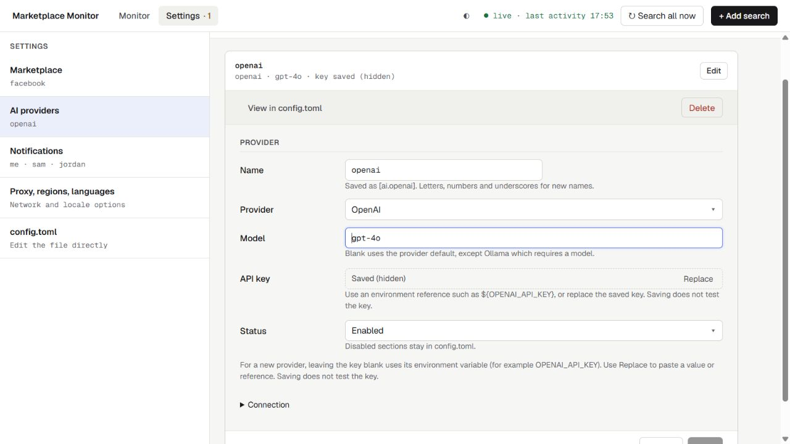

*Figure 9. Saving validates configuration, not AI-provider connectivity.*

The selector offers OpenAI, Anthropic, DeepSeek, Gemini, and Ollama. A new non-Ollama
provider with no pasted key uses an explicit environment reference such as
`${OPENAI_API_KEY}`. Set it in the monitor process's environment before startup.
A not-set label means the variable is unavailable to that process; the browser
cannot set the server's environment.

PowerShell example with a placeholder:

```powershell
$env:OPENAI_API_KEY = 'replace-with-your-key'
ai-marketplace-monitor
```

Ollama needs a model and reachable endpoint, for example `http://localhost:11434/v1`.
Inside a container, localhost refers to that container. Connection fields include
Base URL, Timeout, and Max retries. The UI does not download models or start an
external AI service. Disable a provider to retain its configuration while excluding
it from the default enabled-provider selection.

## 13. Set up notification users

A user is a named recipient, not a separate dashboard login account. Searches
refer to these names in Notify users.

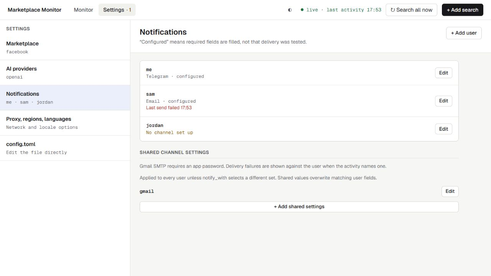

*Figure 10. Configured means required fields exist; recent send failures can be shown.*

1. Open **Settings > Notifications** and edit a user or choose **+ Add user**.
2. Select channels to reveal their fields.
3. Supply required values directly or through shared settings, then save.
4. Select that user in the searches that should send alerts.

| Channel | Main fields |
| --- | --- |
| Telegram | Bot token and chat ID. |
| Email | Recipient address(es) and SMTP credentials/settings. |
| Pushbullet | Token. |
| Pushover | User key and API token. |
| ntfy | Server URL and topic. |

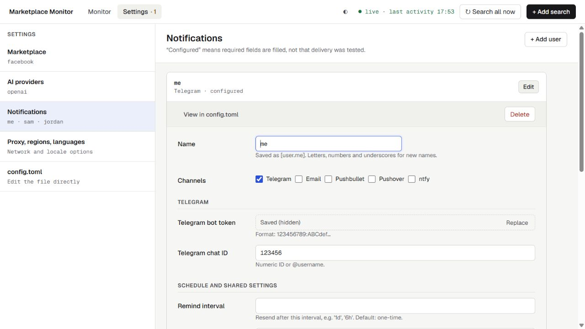

*Figure 11. Choose channels without revealing saved credentials.*

Obtain credentials through each service's own setup process. Save does not create
accounts or bots, nor test delivery. Email options include SMTP server, port,
username, password, and From address. The UI notes that Gmail SMTP needs an app
password.

Remind interval controls repeat notifications for previously notified listings;
it is separate from the search interval. More options include format, description
length, retries, delay, and rate limits. Inherited channels may need edits in their
source file before removal. Check actual activity and the recipient to verify delivery.

## 14. Use shared notification settings

Shared sections reuse delivery settings across users, such as one SMTP account
with a different recipient email on each user.

1. Choose **+ Add shared settings** under Shared channel settings.
2. Name it, for example `shared_email`, select its channel, and fill the fields.
3. Save and review which users inherit it.

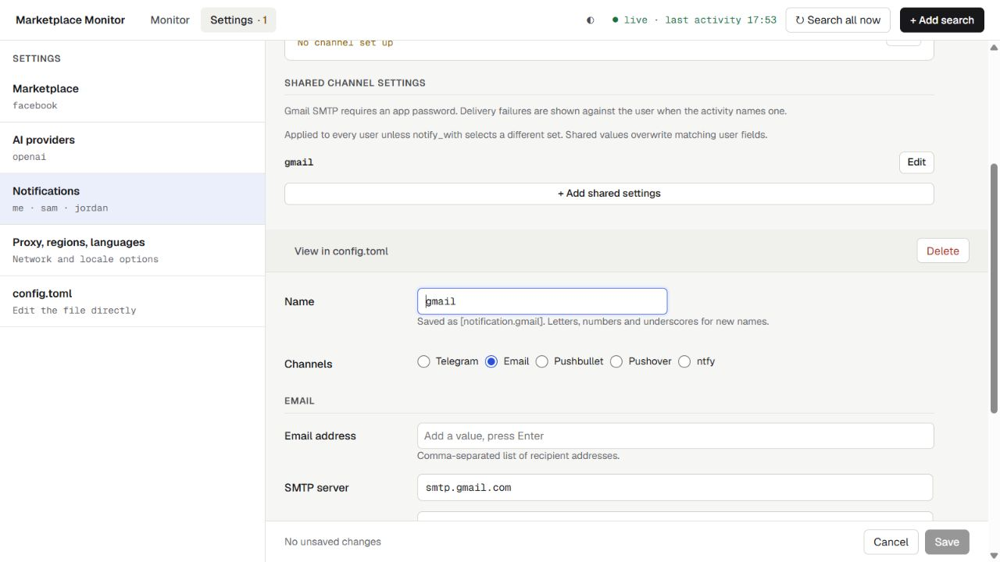

*Figure 12. Shared values overwrite matching user fields, including shared defaults.*

Shared sections apply in configured order. Their non-null fields and normalized
defaults overwrite user fields; they are not just fallbacks for blanks.

| User's `notify_with` | Shared settings applied |
| --- | --- |
| Absent | All enabled shared sections in configured order. |
| Named list | The selected enabled sections in list order. |
| Explicit empty list | None. |

For example, give `sam` a recipient email and put the server/password in
`shared_email`. Avoid a recipient address in the shared section unless you intend
it to overwrite every affected user's recipient address.

Choose **Use SMTP on this user only** to exclude shared email settings for one
user, then fill that user's SMTP fields. Earlier-file `notify_with` entries must
still be changed at their source if they prevent exclusion.

## 15. Configure proxies, regions, and languages

### Proxies

Open **Settings > Proxy, regions, languages**. Add proxy URLs one at a time and
press Enter. Set Bypass and credentials if your network needs them. Saving does
not test proxy connectivity. Leave proxy settings alone if your network needs none.

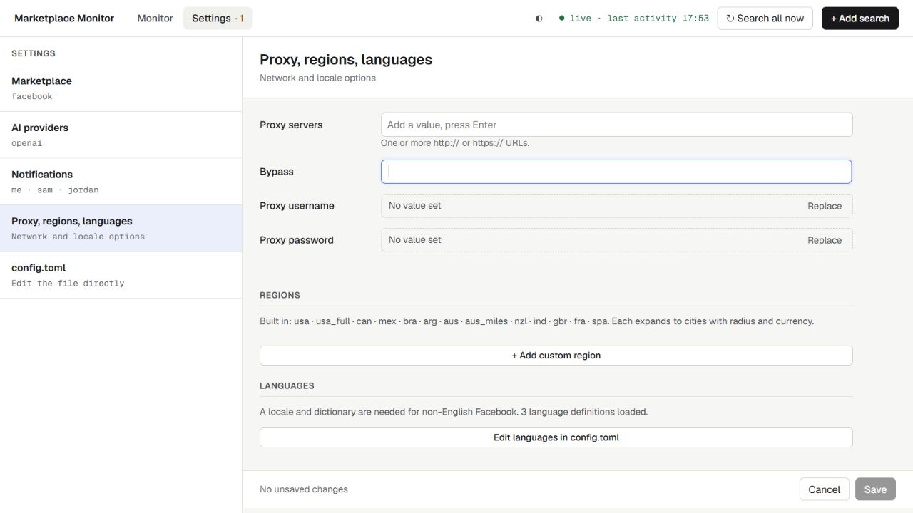

*Figure 13. Network options, reusable locations, and language definitions share this area.*

### Custom regions

1. Choose **+ Add custom region** and name it `texas_cameras`.
2. Enter a Full name and add `houston` and `austin` as city chips.
3. Optionally add matching display names and radiuses.
4. Add one currency, `USD`, when it applies to every city.
5. Save and select the region in a search's location controls.

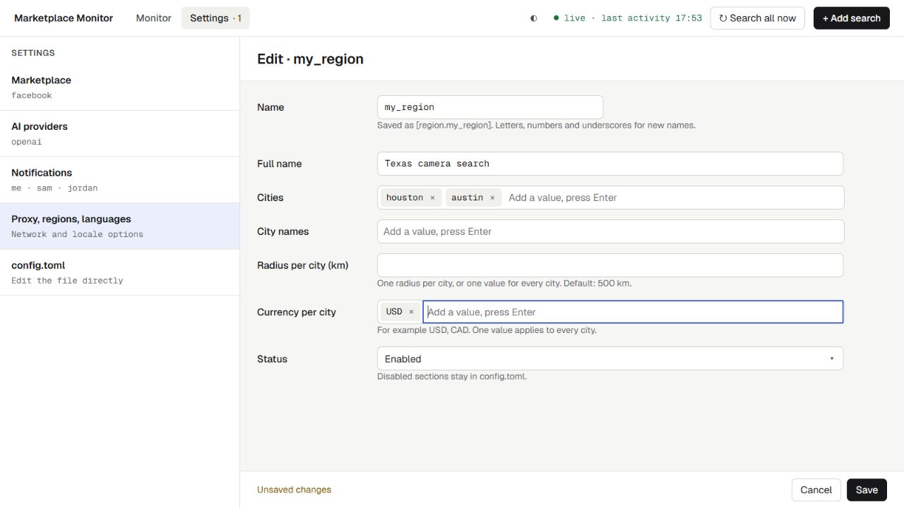

*Figure 14. One currency applies to all cities; multiple values must align with the city list.*

Equivalent TOML:

```toml
[region.texas_cameras]
full_name = "Texas camera search"
search_city = ["houston", "austin"]
radius = 50
currency = "USD"
```

A single region radius applies to every city. The region default is 500 km when
none is supplied, so set an explicit narrower radius when appropriate. Multiple
per-city values must match the city list.

### Languages

Choose **Edit languages in config.toml** for translation definitions and custom
language options. Marketplace Language must match the relevant `[translation.*]`
definition. Entering an arbitrary language name does not automatically translate
Facebook's interface.

## 16. Edit TOML and keep secrets safe

Open **Settings > config.toml** for options or structures beyond guided forms. Its
header lists contributing sources and marks the last loaded file as editable.

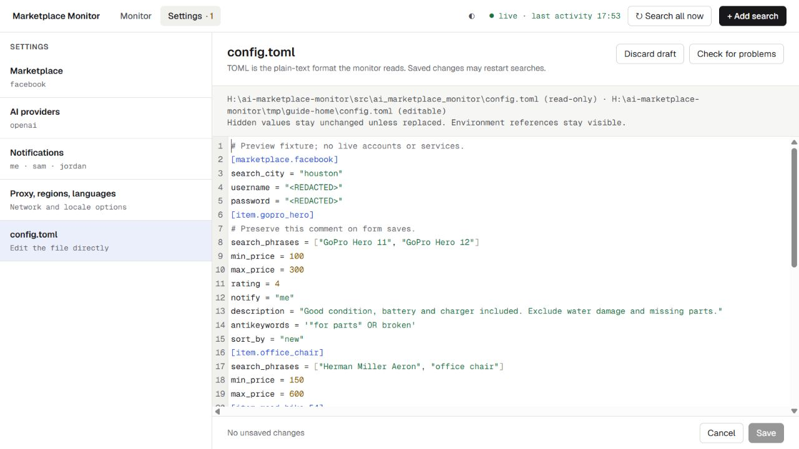

*Figure 15. Masks retain corresponding saved values when the file is written.*

Text uses quotes; numbers normally do not. Lists use brackets and booleans are
`true` or `false`. A line beginning with `#` is a comment. For example:

```toml
[item.camera]
search_phrases = ["Canon camera", "Nikon camera"]
max_price = 300
enabled = true
ai = []
```

Guided edits preserve comments and unknown fields. Choose **Check for problems**
to validate against all loaded files. Raw edits also trigger validation after a
short delay. Syntax errors may highlight a line and disable Save. Ctrl+S (Command+S
on macOS) saves from the editor. Discard draft confirms before replacing edits.

Saved (hidden) means a value exists without revealing it. Environment references
remain visible, but their resolved secret values are not returned to the browser.
Replace accepts a new value or reference; an empty replacement or Keep current
retains the current value.

Raw `<REDACTED>` masks correspond to specific saved sections and fields. Do not
invent a mask for a new secret or copy a masked section and assume its credentials
move with it. Use a guided rename or explicitly replace the secret.

Scalar secret assignments support quoted keys and multiline strings. Secrets
inside arrays or inline tables can prevent the editor from opening; move them to
supported scalar assignments in the source file. UI masking does not encrypt the
underlying TOML. Keep original files and configuration backups private.

## 17. Save and recover from conflicts

Save validates before writing. On validation failure, your draft remains available:
read the message, correct the problem, and retry. A successful save is atomic, but
application at the monitor's next safe point may restart searches.

Wait for Saving to finish before another edit, deletion, or navigation. Cancel and
navigation ask before discarding dirty drafts. Session expiry keeps the current
tab's draft while you sign in again; save before closing or reloading.

Another editor or tab may change the file while your draft is open. The conflict
warning offers Compare, Reload and re-apply, and Overwrite.

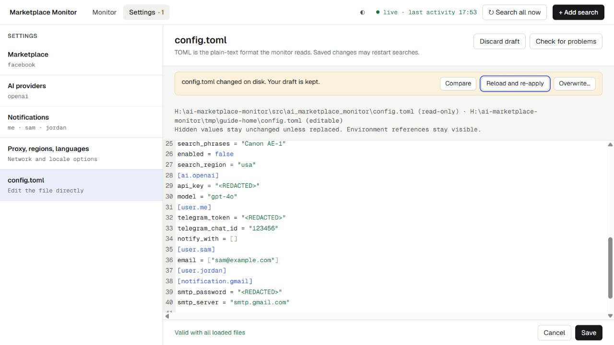

*Figure 16. The draft is kept when a newer file is detected.*

1. Choose **Compare** and review the masked draft and current file.
2. For a form, choose **Reload and re-apply** to retain your field edits on the
   current file; review and save again.
3. For raw TOML, reload asks to replace the draft. Copy necessary edits into a safe
   local note before accepting **Load file**.
4. Choose **Overwrite** only when you deliberately want your draft to replace
   changes made since you opened it. Read the confirmation.

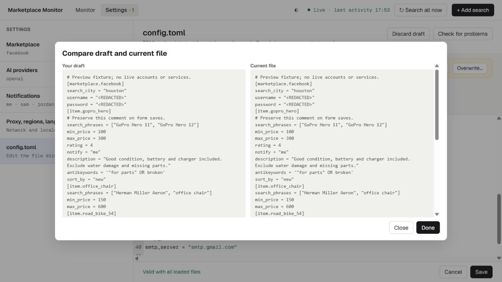

*Figure 17. Line differences help review changes; Overwrite is separately confirmed.*

Repeated Save clicks do not resolve a conflict. Decide which edits must survive,
reconcile them, and save the reviewed result.

## 18. Use themes and keyboard controls

The header theme button cycles system, light, and dark. System follows your
operating system. Your browser remembers the choice.

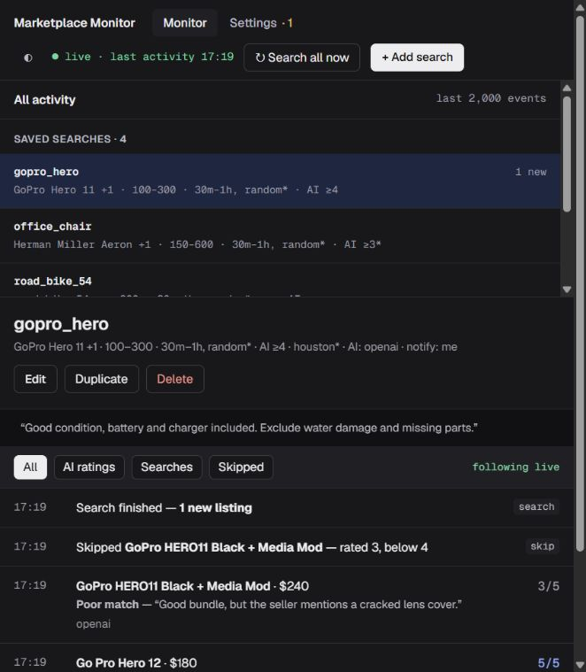

*Figure 18. The list stacks above content in narrow windows.*

Tab and Shift+Tab move between controls. Enter activates buttons and adds chips.
Skip to content focuses the selected page. Confirmation dialogs start on the safe
action; Escape cancels a normal confirmation and keeps the draft. The sign-in
dialog remains open until authentication succeeds.

Activity announces short update summaries rather than reading every record.
Pause while inspecting older messages. The interface supports keyboard and
semantic accessibility; this guide does not claim external screen-reader certification.

## 19. Access the dashboard remotely

To access from another computer, configure marketplace credentials or both
Facebook environment variables, then bind the server to a network interface.
Use placeholders locally, replacing them before startup:

```powershell
$env:FACEBOOK_USERNAME = 'you@example.com'
$env:FACEBOOK_PASSWORD = 'replace-with-your-password'
ai-marketplace-monitor --webui-host 0.0.0.0 --webui-port 8467
```

Open `http://YOUR-SERVER-IP:8467` from the other computer. The bind address
`0.0.0.0` is not the browser's destination. Sign in with credentials captured at
startup. Valid sessions survive normal refresh; after expiry sign in again in the
current tab to keep its draft. Restart after changing dashboard login credentials.

Non-loopback exposure without credentials is refused unless an explicitly configured
local-only deployment mode is used. If necessary, add an inbound port rule in
Windows Defender Firewall with Advanced Security. Limit access to intended networks;
use a properly configured TLS reverse proxy or VPN for untrusted networks. Plain
HTTP does not encrypt sign-in or configuration changes in transit.

In supported Docker deployments, Browser appears only when VNC/noVNC is enabled
and available. Use it for Facebook's own login prompts, or use the monitor's browser
on its host. Local-only Docker mode assumes port publication is restricted to
loopback; it is not a way to expose an unauthenticated dashboard remotely.

| CLI option | Default | Purpose |
| --- | --- | --- |
| `--webui / --no-webui` | Enabled | Start or disable the dashboard. |
| `--webui-host` | `127.0.0.1` | Bind address; non-loopback access needs authentication. |
| `--webui-port` | `8467` | HTTP port. |
| `--webui-log-retention` | `2000` | Events retained in memory. |
| `--config` / `-r` | Default user file | Load extra sources; edit only the last loaded file. |

The standard user file is `~/.ai-marketplace-monitor/config.toml`, typically
`C:\Users\YOUR-NAME\.ai-marketplace-monitor\config.toml` on Windows. See the exact
loaded and editable paths in Settings > config.toml.

## 20. Troubleshoot and establish a routine

| Symptom | What to check |
| --- | --- |
| Site cannot be reached | The monitor process is running; use its printed address and port. |
| Waiting for Facebook credentials | Marketplace login or environment variables, then the actual host browser. |
| Facebook requests a code or CAPTCHA | Complete it in the host browser or available Browser view. |
| Reconnecting | Wait or use Retry if offered; check whether the monitor process stopped. |
| Activity seems stuck | Resume Show and follow live if the display is paused. |
| No matching events | Clear combined filters and check the selected search is enabled. |
| No channel set up | Supply required fields on the user or selected shared section. |
| Configured channel fails | Inspect All activity, Details, real service credentials, and shared overrides. |
| No AI evaluation or provider errors | Provider enabled, selected, reachable, and key available to the running process. |
| User field seems ignored | A shared section may overwrite it, including with defaults. |
| Removing a chip has no effect | An earlier source may still contribute a list entry. |
| Manual run is delayed | The current scan or Facebook login may still be in progress. |
| Save disabled | No changes, an in-progress save, or invalid raw TOML. |
| Save fails | Retain the draft, correct the validation message, and retry. |
| File changed on disk | Compare and reconcile with section 17. |
| Mask cannot be restored | Use a proper rename or replace the value; new sections cannot invent saved secrets. |
| Empty CSV | No notified listings in cache; AI ratings alone do not establish notified records. |
| New remote password does not work | Restart so authentication uses the new startup credentials. |

### Daily checklist

1. Confirm the process runs and the activity connection is live.
2. Check global notices for login, browser, or config issues.
3. Review phrases, budget, location, AI, and recipients in search summaries.
4. Inspect All activity for errors and delivery failures.
5. Tune one meaningful criterion at a time, save, and inspect the effect.
6. Resume live following after reading older activity.
7. Export a CSV when you need a cached notification snapshot.
8. Keep a private backup before substantial configuration changes.

Recent activity is buffered, not persistent history. There is no per-search
execution button, next-run countdown, or built-in provider/delivery connection test.
Save and Configured describe configuration state. Verify live services and actual
receipt to establish operational success.

See the [configuration guide](configuration-guide.rst), [configuration reference](configuration.rst),
and [troubleshooting](troubleshooting.rst) for deeper application details.
